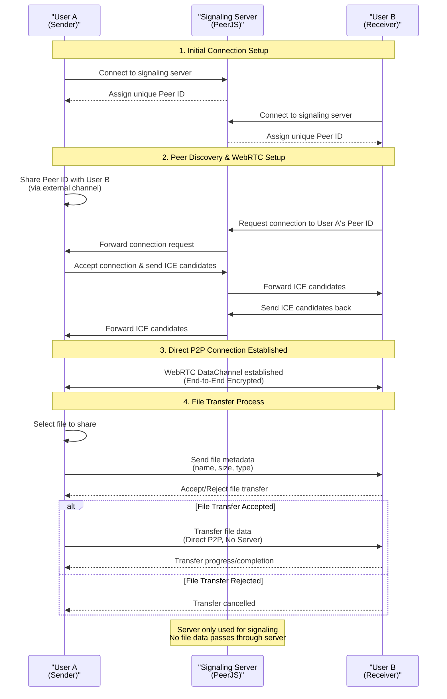

# Innerocket

Innerocket is a secure peer-to-peer file sharing application that uses WebRTC technology to transfer files directly between users without sending any file data through servers.

## Features

- **Secure P2P File Sharing**: Transfer files directly between browsers without going through a server
- **End-to-End Encryption**: All WebRTC data channels are encrypted by default
- **No File Size Limits**: Share files of any size (limited only by browser memory)
- **Simple User Interface**: Easy to use interface built with Tailwind CSS
- **No Account Required**: Just open the app and start sharing
- **Send Multiple Files**: Select and send several files in one go

## How It Works

1. **Connect**: Share your peer ID with the person you want to send files to
2. **Select**: Choose the file you want to share
3. **Send**: Transfer the file directly to the recipient
4. **Receive**: The recipient gets a notification to accept or reject the file

<details>
<summary><strong>Technical Connection Flow Diagram</strong></summary>



This diagram illustrates the complete technical flow of how Innerocket establishes peer-to-peer connections and transfers files securely without sending any file data through servers.

</details>

## Security

Innerocket uses WebRTC's data channels which are encrypted by default. No file data ever passes through our servers - the server is only used for the initial connection setup (signaling).

- Sensitive metadata persisted in the browser uses AES-GCM keys derived from 32-byte CSPRNG secrets via PBKDF2 (SHA-256, 310,000 iterations, 16-byte salt) to keep parameters transparent for security reviews.

## Getting Started

### Prerequisites

- Node.js (version 20 or higher)
- pnpm package manager

### Installation

```bash
# Clone the repository
git clone https://github.com/innerocket/innerocket.git
cd innerocket

# Install dependencies
pnpm install

# Start the development server
pnpm dev
```

### Building for Production

```bash
pnpm build
```

### Analytics Configuration

Innerocket supports optional analytics integration with Google Analytics (GA4) and Cloudflare Web Analytics. Analytics are only enabled in production builds when environment variables are explicitly configured.

#### Environment Variables

Configure analytics by setting these environment variables:

```bash
# Google Analytics (GA4)
VITE_GOOGLE_ANALYTICS_ID=G-XXXXXXXXXX

# Cloudflare Web Analytics
VITE_CLOUDFLARE_ANALYTICS_TOKEN=YOUR_BEACON_TOKEN
```

#### Analytics Features

- **Production Only**: Analytics scripts are only loaded when `NODE_ENV=production`
- **Privacy Respecting**: Honors Do Not Track browser settings
- **Conditional Loading**: Scripts are only loaded when environment variables are set
- **Non-blocking**: Uses `async`/`defer` for optimal performance
- **Privacy Enhanced**: Google Analytics configured with anonymized IP and disabled personalization

#### Disable Analytics

To disable analytics, simply don't set the environment variables or set them to empty values. When no analytics environment variables are configured, no tracking scripts are loaded.

## Technologies Used

- [SolidJS](https://solidjs.com/) - Reactive UI library for the web
- [WebRTC](https://webrtc.org/) - Real-time communication for the web
- [PeerJS](https://peerjs.com/) - Simplifies WebRTC peer-to-peer data connections
- [Tailwind CSS](https://tailwindcss.com/) - A utility-first CSS framework

## Contributing

We welcome contributions to Innerocket! Whether you're fixing bugs, adding new features, or improving documentation, your help is appreciated.

For detailed contribution guidelines, please see:
- [Contributing Guide](docs/CONTRIBUTING.md) - Complete setup instructions, development workflow, and pull request process
- [Code of Conduct](docs/CODE_OF_CONDUCT.md) - Community standards and expected behavior

Quick start for contributors:
1. Fork the repository
2. Create a feature branch
3. Follow our coding standards and commit conventions
4. Submit a pull request

## License

This project is licensed under the MIT License - see the [LICENSE](LICENSE) file for details.
