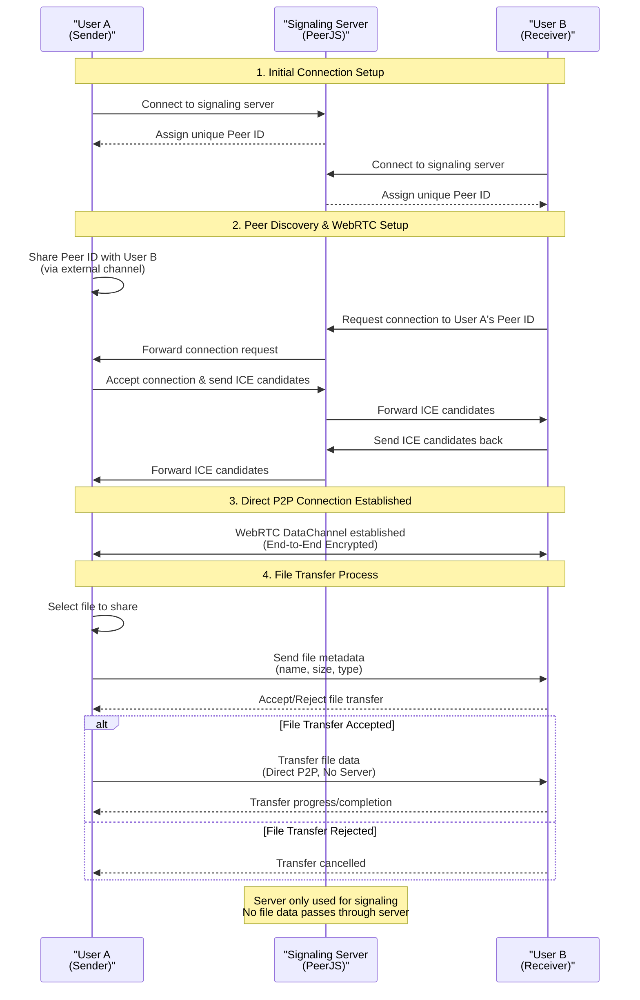

# Innerocket

Innerocket is a secure peer-to-peer file sharing application that uses WebRTC technology to transfer files directly between users without sending any file data through servers.

## Features

- **Secure P2P File Sharing**: Transfer files directly between browsers without going through a server
- **End-to-End Encryption**: All WebRTC data channels are encrypted by default
- **No File Size Limits**: Share files of any size (limited only by browser memory)
- **Simple User Interface**: Easy to use interface built with Tailwind CSS
- **No Account Required**: Just open the app and start sharing
- **Send Multiple Files**: Select and send several files in one go

## How It Works

1. **Connect**: Share your peer ID with the person you want to send files to
2. **Select**: Choose the file you want to share
3. **Send**: Transfer the file directly to the recipient
4. **Receive**: The recipient gets a notification to accept or reject the file

<details>
<summary><strong>Technical Connection Flow Diagram</strong></summary>



This diagram illustrates the complete technical flow of how Innerocket establishes peer-to-peer connections and transfers files securely without sending any file data through servers.

</details>

## Security

Innerocket uses WebRTC's data channels which are encrypted by default. No file data ever passes through our servers - the server is only used for the initial connection setup (signaling).

## Getting Started

### Prerequisites

- Node.js (v20 or newer)
- pnpm

### Installation

```bash
# Clone the repository
git clone https://github.com/innerocket/innerocket.git
cd innerocket

# Install dependencies
pnpm install

# Start the development server
pnpm dev
```

### Building for Production

```bash
pnpm build
```

## Technologies Used

- [Preact](https://preactjs.com/) - A fast 3kB alternative to React with the same API
- [WebRTC](https://webrtc.org/) - Real-time communication for the web
- [PeerJS](https://peerjs.com/) - Simplifies WebRTC peer-to-peer data connections
- [Tailwind CSS](https://tailwindcss.com/) - A utility-first CSS framework

## License

This project is licensed under the MIT License - see the LICENSE file for details.
